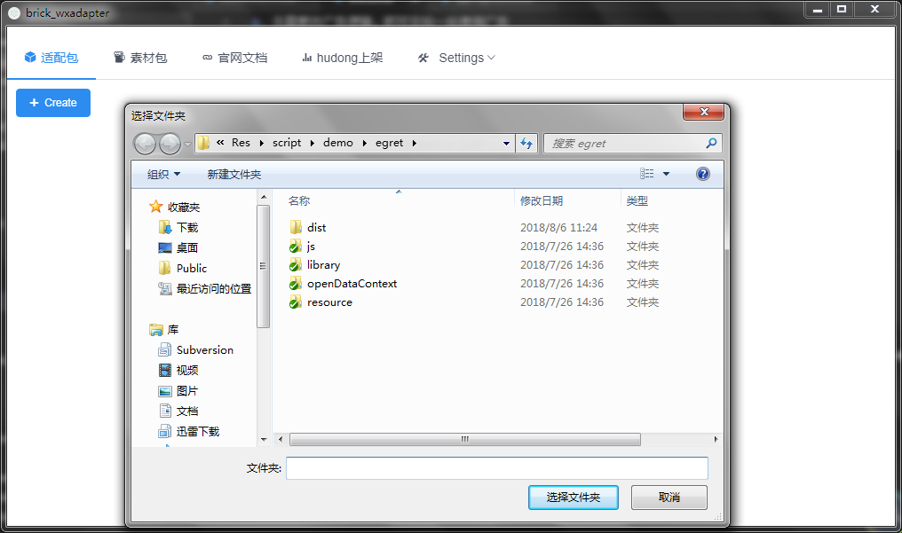
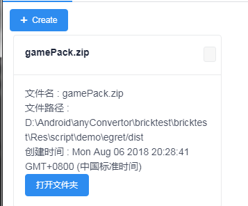
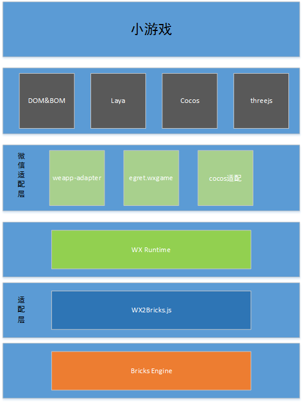

# 更新说明
游戏目录下增加gameConfig文件，里面需要关注的人配置如下：
debug 是否输出debug日志
engine 引擎类型例如egret
# 适配工具能力说明
本适配工具主要是提供一键将微信小游戏的游戏包转换到QQ玩一玩平台运行的能力,开发者无需改动过多代码，即可将`wx.*` 下的接口无缝适配到`BK.*`下的接口

## 工具能做什么
1. 一键将微信小游戏的脚本包转换到QQ玩一玩平台上运行
2. 分享到微信接口会被适配为分享到QQ好友、QQ群、空间、朋友圈等
3. 排行榜、好友头像无需更改代码可直接转换为QQ下的好友
4. 无需更改广告逻辑，即可在玩一玩使用广告

## 转换后还需做哪些
1. 适配层提供的wx.login接口会直接返回用户的openid与openkey，因此后台登录校验逻辑需要修改。
2. 游戏后台使用前端传递的openid与openkey 与玩一玩的后台通信进行后台鉴权
3. 道具上架逻辑与微信体验不一致,需开发者在hudong.qq.com上架，并开发对应逻辑
4. 如果是白鹭引擎转换的游戏，请在main.js里面添加window.EGRET_GAME = true，放在entry.js加载之前

# 如何使用工具
开发者可选择两种方式来使用适配工具
1. GUI打包工具
2. webpack脚本

## GUI打包工具
<a href="https://github.com/QQBricks/brick_wxadapterGUI" target="_blank"> github下载地址</a>

* **点击选择微信小游戏所在文件夹**



* **等待打包完成**


* **运行完成后会在目录下生成文件**


其中压缩包内文件即为转换后的适配文件,文件结构如下
```js
├── brick_wxadapter.js 微信适配层
├── qqPlayCore.js  玩一玩核心模块
├── main.js  入口文件
├── promise.js  
├── gameConfig.json  游戏配置文件，开发者应自行修改
└── entry.js  原微信小游戏打包后的代码
```


## webpack打包工具

```js
├── brick_wxadapter.js 微信适配层
├── qqPlayCore.js  玩一玩核心模块
├── main.js  入口文件
├── promise.js  
├── 一键转换使用说明.pdf  
├── package.json   npm包依赖，用来安装webpack依赖组件
├── strip.js  移除use strict与canvas差异的脚本
└── webpack.config.js  webpack打包文件 (打包entry.js)
```
**entry.js游戏逻辑打包**

1. 将webpack.config.js,strip.js,package.json拷贝至游戏主目录
2. 将开放数据域的代码在游戏本身game.js中引用 如：
```js
	...
	require("./OpenDataContext/index.js")
    ...
```
3. 安装webpack打包依赖
```shell
	npm install 
```
4. webpack打包游戏主逻辑
```js
    webpack --config webpack.config.js
```
    执行完成后会在dist目录生成entry.js文件


**最终打包**

将 brick_wxadapter.js qqPlayCore.js main.js promise.js 资源文件夹拷贝到同一目录，使用zip命令打包成压缩文件。
详细可参见：http://hudong.qq.com/docs/engine/debug/package.html

**注意事项**

* 目前适配层的canvas 要比微信小游戏的Canvas多一层继承链，部分使用了微信weapp-adapter.js的游戏需要将`Canvas.__proto__.__proto__`修改为`Canvas.__proto__.__proto__.__proto__`
* `gl.creatTexture` 返回的是数字id
* 最好移除下代码里的`use strict`

```shell
	sed -i ".bak" -e 's/"use stict"//g' dist/entry.js
```

# 整体架构


